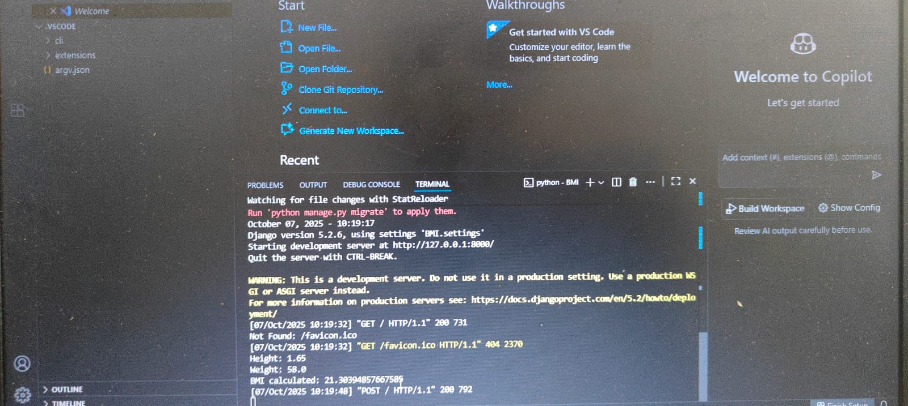

# Ex.05 Design a Website for Server Side Processing
## Date:

## AIM:
 To design a website to calculate the power of a lamp filament in an incandescent bulb in the server side. 


## FORMULA:
P = I<sup>2</sup>R
<br> P --> Power (in watts)
<br> I --> Intensity
<br> R --> Resistance

## DESIGN STEPS:

### Step 1:
Clone the repository from GitHub.

### Step 2:
Create Django Admin project.

### Step 3:
Create a New App under the Django Admin project.

### Step 4:
Create python programs for views and urls to perform server side processing.

### Step 5:
Create a HTML file to implement form based input and output.

### Step 6:
Publish the website in the given URL.

## PROGRAM :
```
template.html
<!DOCTYPE html>
<html>
<head>
    <title>BMI Calculator</title>
</head>
<body bgcolor="lightblue">
    <center style="font-size: 24px;">
        <h1 style="color:rgb(255,0,0)">BMI Calculator</h1>
        <form method="POST">
            
            <label style="color:rgb(0, 116, 0)">Height (m):</label><br>
            <input type="text" name="height"><br><br>
            <label style="color:rgb(0,0,255)">Weight (kg):</label><br>
            <input type="text" name="weight"><br><br>
            <button type="submit">Calculate</button>
        </form>
        
            <h3>Your BMI is: {{ BMI }}</h3>
        
    </center>
</body>
</html>


views.py
from django.shortcuts import render
def calculate_bmi(request):
    bmi = None   # Default value
    if request.method == "POST":
        height = float(request.POST.get("height"))
        weight = float(request.POST.get("weight"))
        bmi = weight / (height * height)

        # Print to server console for debugging
        print("Height:", height)
        print("Weight:", weight)
        print("BMI calculated:", bmi)
    return render(request, "bmiapp/template.html", {"BMI": bmi})


urls.py
from django.contrib import admin
from django.urls import path
from bmiapp import views
urlpatterns = [
    path('admin/', admin.site.urls),
    path('', views.calculate_bmi, name='calculate_bmi'),
]
```


## SERVER SIDE PROCESSING:


## HOMEPAGE:


## RESULT:
The program for performing server side processing is completed successfully.
